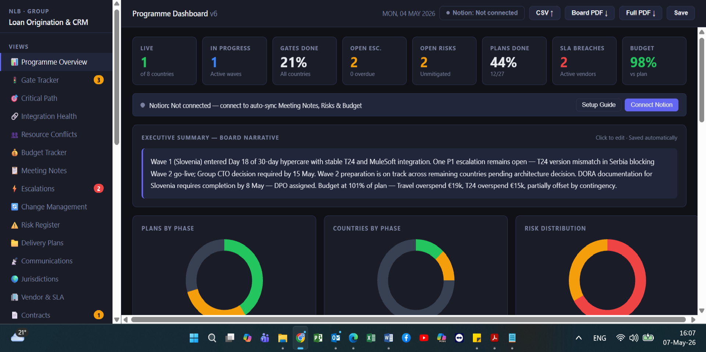

# Fintech Programme Dashboard

**Multi-country core banking delivery — live programme intelligence for Group CTOs and Programme Directors.**

---

## What This Dashboard Does

A single-screen view of an 8-country, multi-wave core banking programme. Built for the Programme Director who needs to know — in 30 seconds — what is live, what is blocked, and what requires a decision today.

All data is configurable via admin panel. One template, any client, any programme.

---

## What a Hiring Manager Sees in 30 Seconds

| Section | What it shows |
|---------|--------------|
| **KPI Strip** | Live countries, active waves, gates done %, open escalations, open risks, plans done %, SLA breaches, budget vs plan |
| **Executive Summary** | Editable board narrative — click to update, saves automatically |
| **Gate Tracker** | Every country's current gate, missing documents, days at risk, blocker owner |
| **Critical Path** | Step-by-step blocker chain per country — what is actually delaying go-live |
| **Integration Health** | API uptime, version matrix, incidents — T24 ↔ MuleSoft ↔ Azure per country |
| **Resource Conflicts** | Cross-country resource clashes flagged before they become blockers |
| **Budget Tracker** | Planned vs actual per category, variance, burn rate, forecast |
| **Meeting Notes** | Structured meeting output directly in the dashboard |
| **Escalations** | Open escalations with owner, age, and resolution status |
| **Risk Register** | Live risk register with RAG, mitigation, owner |
| **Delivery Plans** | 25+ plans tracked by phase — initiated vs active vs complete |

---

## Three Design Decisions That Matter

**1. Governance before dashboard**
Gate framework, RACI, and hard blockers were defined first — then the dashboard was built to display them. This shows governance, not just activity.

**2. Integration as a first-class citizen**
Most programme dashboards track features or countries. This one tracks API integrations as a separate programme — because in a core banking rollout, T24 ↔ MuleSoft ↔ Azure *is* the critical path.

**3. Built for reuse**
Admin panel lets you reconfigure for any client in 10 minutes: replace countries, vendors, programme name, wave structure. This is a product, not a one-off PowerPoint.

---

## Notion Integration

Dashboard connects to Notion via API — meeting notes, risks, and budget data sync automatically when connected. Runs fully offline without Notion for demo and standalone use.

---

## Demo

**Demo available at interview or on request.**

This dashboard is part of the AI Delivery OS — a layered system of agents and dashboards built for regulated, multi-country fintech and RWA delivery programmes.

→ [biljana.obradovic@concept360.rs](mailto:biljana.obradovic@concept360.rs)
→ [linkedin.com/in/biljana-obradovic-28390a8](https://linkedin.com/in/biljana-obradovic-28390a8)

---

*Built by Biljana Obradović · Concept360 · 2026*
*Attribution required for derivative works.*
