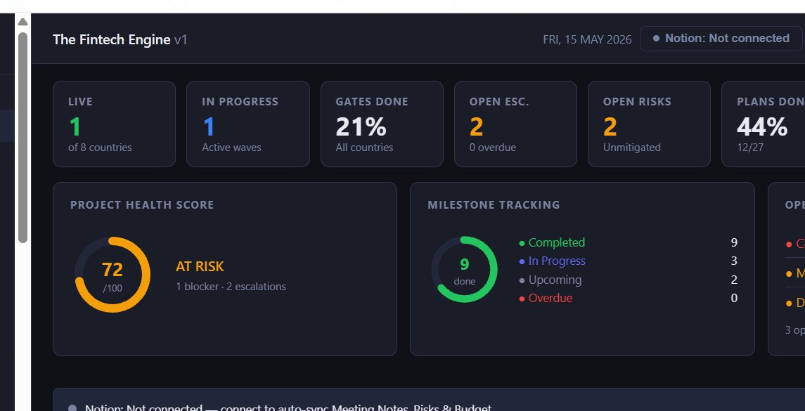

# Concept360 — Delivery-Intelligence-System 
**Programme intelligence for multi-country core banking delivery.**

---

Multi-country core banking programmes are won or lost before the first wave goes live.

Gate governance that exists only in PowerPoint. Integration dependencies discovered at UAT. A Group CTO who learns about a critical blocker in a weekly status report — three days after it became unrecoverable.

**The Fintech Delivery Engine puts the Group CTO and Programme Director in control. From Day 1.**

---

## What It Does

One screen. 30 seconds. Everything a Group CTO needs to know about an 8-country, multi-wave programme.

> Gate tracker · Critical path per country · Integration health (core system ↔ middleware ↔ cloud) · Budget variance · Open escalations · Risk register · Delivery plans · Wave readiness

---

## Three Problems It Solves

**1. No single source of truth across countries and waves**
Wave 1 is in hypercare. Wave 2 is in UAT. Wave 3 is in vendor selection. No one has a single view that shows all three simultaneously — with blockers, owners, and resolution status. The Fintech Delivery Engine is that view.

**2. Integration risk that surfaces too late**
In a core banking rollout, the integration is the critical path — not the feature backlog. T24 ↔ middleware ↔ cloud per country, tracked as a separate programme stream with version matrix, API uptime, and incident history visible at all times.

**3. Governance that only exists in documentation**
RACI, gate criteria, escalation paths — defined in documents that no one reads under pressure. The Fintech Delivery Engine operationalises governance: gates are tracked, escalations are triggered automatically, and decisions are logged with owners and timestamps.

---

## Built For

Group CTOs · Programme Directors · Delivery leads managing multi-country, multi-vendor, multi-wave banking technology implementations

---

**For a live demo — DM me.**

→ [biljana.obradovic@concept360.rs](mailto:biljana.obradovic@concept360.rs)
→ [linkedin.com/in/biljana-obradovic-28390a8](https://linkedin.com/in/biljana-obradovic-28390a8)

---

*Constellation360 · Concept360 · 2026*
