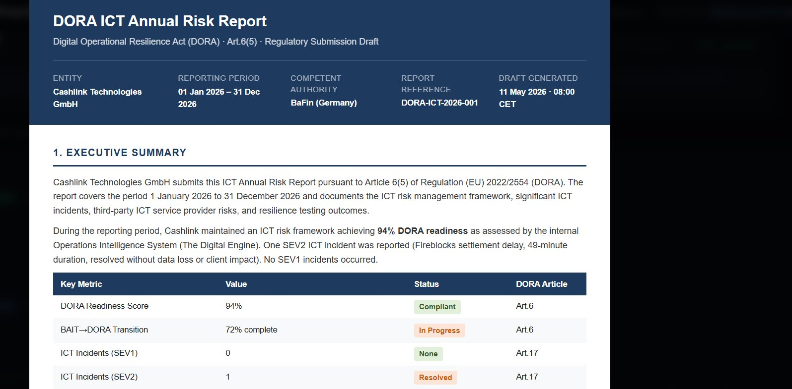

# Constellation360 — The Digital Engine
**Operations intelligence for regulated infrastructure providers.**

---

Infrastructure providers in the RWA and tokenisation space have solved the technology problem.

The custody is licensed. The smart contracts are audited. The blockchain is live.

What breaks first is rarely the technology. It is the operating model between the infrastructure provider, the issuers who depend on it, and the regulators who oversee it.

Who owns the DORA readiness score?
Who tracks the Fireblocks SLA before it breaches?
Who tells the issuer their onboarding is blocked — and why — without an email chain?

**The Digital Engine answers those questions. Operationally. In real time.**

---

## What It Does

One screen. 20 operational workflows. Every domain a regulated infrastructure provider needs to manage simultaneously.

> DORA readiness · ICT incident tracking · 4-hour regulatory reporting countdown · Issuer pipeline with gate-level visibility · Third-party ICT register with concentration risk flags · Proof of Reserve · AI-drafted regulatory reports pending CISO sign-off

---

## Three Problems It Solves

**1. Operational blindness between programme and live operations**
The issuer is at L3. The ops team doesn't know what's blocking go-live. The programme team doesn't know what's happening to live issuers. The Digital Engine closes that gap with a single, real-time view across both.

**2. Compliance as a reactive exercise**
DORA reports written once a year under pressure. ICT incidents classified manually. The regulator asks — the firm searches emails. The Digital Engine runs compliance continuously, with AI-drafted outputs ready for human sign-off within minutes of an event.

**3. Third-party risk that no one tracks actively**
Fireblocks degrades. AWS concentration risk crosses the threshold. A fourth-party vendor in the chain has a problem. No one sees it until it becomes a SEV2. The Digital Engine monitors the sub-vendor chain, SLA performance, and concentration risk before it escalates.

---

## Built For

Tokenisation platforms · Regulated custodians · Digital securities infrastructure · CASP licence holders under MiCA · BaFin-regulated infrastructure providers

> *"Built for any firm that holds a digital asset licence and has a regulator asking questions about their operational resilience."*

---

**For a live demo — DM me.**

→ [biljana.obradovic@concept360.rs](mailto:biljana.obradovic@concept360.rs)
→ [linkedin.com/in/biljana-obradovic-28390a8](https://linkedin.com/in/biljana-obradovic-28390a8)

---

*Constellation360 · Concept360 · 2026*
